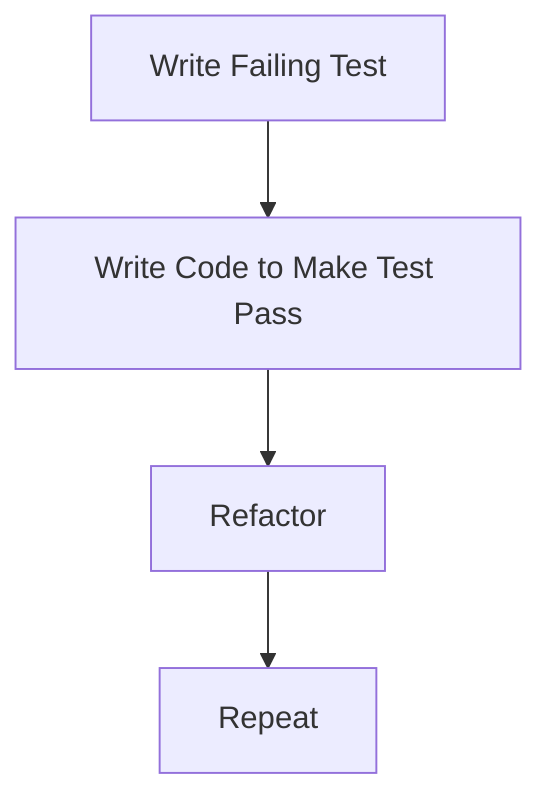

Test Driven Development also Called Test First Method. In TDD You write your test first before writing production Code.

### **Benefits of Test Driven Development**

- Testable source Code from Beginning
- All Code Testing Fully Covered
- Results in Simpler Implementation
