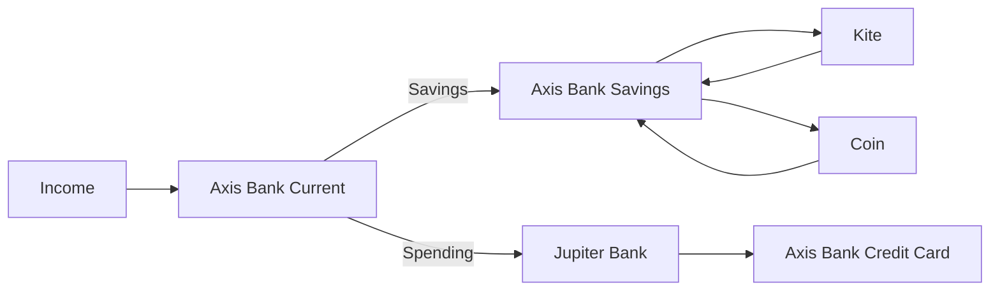

## horizontal hierarchy

```mermaid
  graph LR;
    Income[Income]-->AxisBankCurrent[Axis Bank Current];
    AxisBankCurrent-->|Savings|AxisBankSavings[Axis Bank Savings];
    AxisBankSavings-->ZerodhaKite[Kite]
    ZerodhaKite-->AxisBankSavings
    AxisBankSavings-->ZerodhaCoin[Coin]
    ZerodhaCoin-->AxisBankSavings
    AxisBankCurrent-->|Spending|JupiterBank[Jupiter Bank];
    JupiterBank[Jupiter Bank]-->AxisBankCredit[Axis Bank Credit Card];
```
