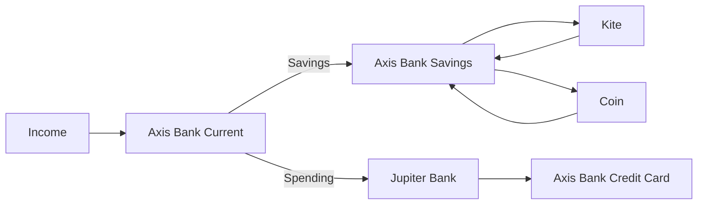
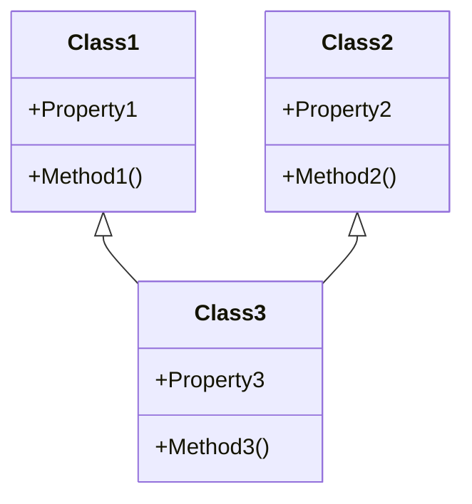
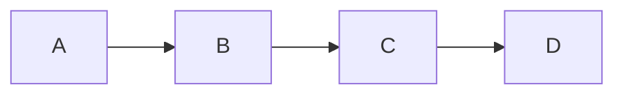

## horizontal hierarchy

```mermaid
  graph LR;
    Income[Income]-->AxisBankCurrent[Axis Bank Current];
    AxisBankCurrent-->|Savings|AxisBankSavings[Axis Bank Savings];
    AxisBankSavings-->ZerodhaKite[Kite]
    ZerodhaKite-->AxisBankSavings
    AxisBankSavings-->ZerodhaCoin[Coin]
    ZerodhaCoin-->AxisBankSavings
    AxisBankCurrent-->|Spending|JupiterBank[Jupiter Bank];
    JupiterBank[Jupiter Bank]-->AxisBankCredit[Axis Bank Credit Card];
```
 
## Class

```mermaid
classDiagram
class Class1{
  +Property1
  +Method1()
}

class Class2{
	+Property2
  +Method2()
}

class Class3{
	+Property3
  +Method3()
}

Class1 <|--Class3
Class2 <|--Class3
```

```mermaid
flowchart LR
    A-->B
    B-->C
    C-->D
    click A callback "Tooltip for a callback"
    click B "https://www.github.com" "This is a tooltip for a link"
    click A call callback() "Tooltip for a callback"
    click B href "https://www.github.com" "This is a tooltip for a link"
```
