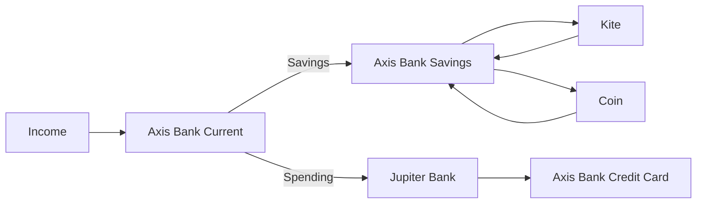
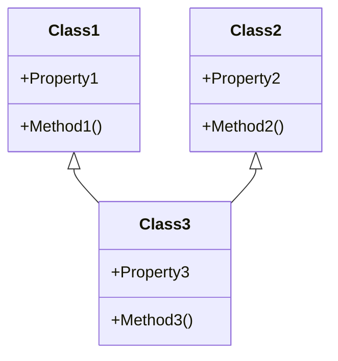

## horizontal hierarchy

```mermaid
  graph LR;
    Income[Income]-->AxisBankCurrent[Axis Bank Current];
    AxisBankCurrent-->|Savings|AxisBankSavings[Axis Bank Savings];
    AxisBankSavings-->ZerodhaKite[Kite]
    ZerodhaKite-->AxisBankSavings
    AxisBankSavings-->ZerodhaCoin[Coin]
    ZerodhaCoin-->AxisBankSavings
    AxisBankCurrent-->|Spending|JupiterBank[Jupiter Bank];
    JupiterBank[Jupiter Bank]-->AxisBankCredit[Axis Bank Credit Card];
```
 
## Class

```mermaid
classDiagram
class Class1{
  +Property1
  +Method1()
}

class Class2{
	+Property2
  +Method2()
}

class Class3{
	+Property3
  +Method3()
}

Class1 <|--Class3
Class2 <|--Class3
```
### Flowchar with different Styles

```mermaid
flowchart LR
    id1(Start)-->id2(Stop)
    style id1 fill:#f9f,stroke:#333,stroke-width:4px
    style id2 fill:#bbf,stroke:#f66,stroke-width:2px,color:#fff,stroke-dasharray: 5 5
```
