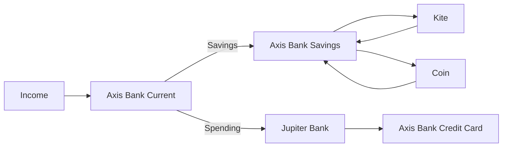

## horizontal hierarchy



## Project Structure
```mermaid
.
├── README.md             <- The project overview.
├── docs                  <- All project documents.
│   ├── doc-1.md
│   └── doc-2.md
└── notebooks             <- All project notebooks.
    ├── notebook-1.ipynb
    └── notebook-2.ipynb

```
